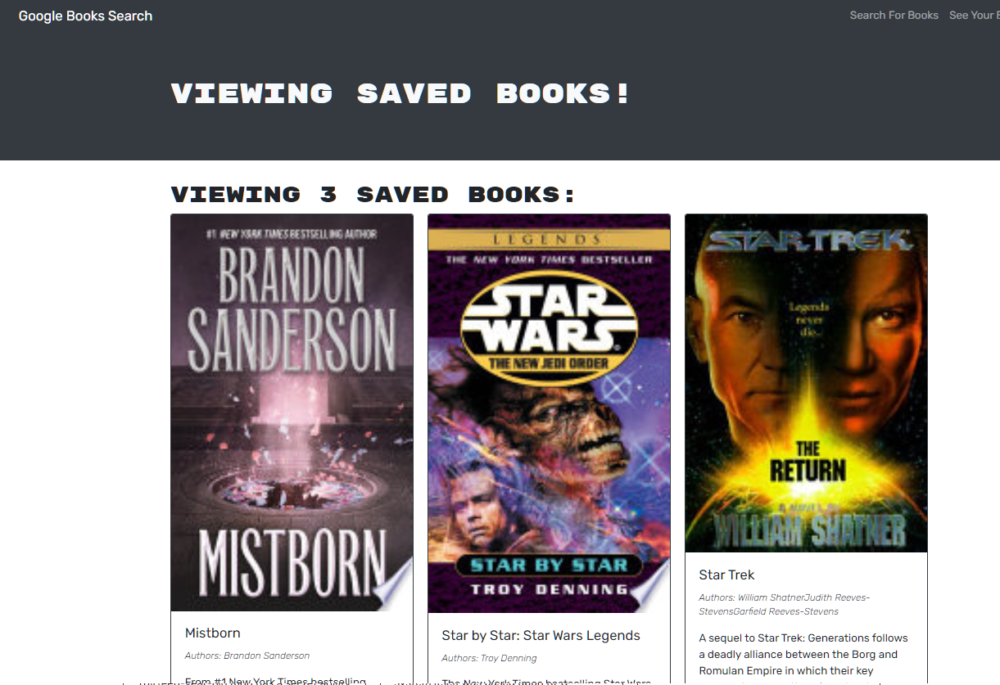

  # Book Search Engine

  

  ## Table of Contents
  * [Description](#description)
  * [Installation](#installation)
  * [Usage](#usage)
  * [Questions](#questions)

  ## Description

  This Book Search Engine was built with REACT, GraphQL, Apollo Server, and google's Books API. Users can search for books, add books to collections, and delete books from collections. The book list requires an account, but sign-up is free and easy.

  ## Installation

  Follow the below steps to install the program locally:

    npm i

  ## Usage

  Check out the launched app: [HERE!](https://book-app-sgm.herokuapp.com/)
  
  Create an account and search for books! Add books from your search to a personal collection, and remove them from the collection page.

  

  ## Questions

  For more information, feel free to contact me:

  GitHub: [github.com/stevengoldbergm](https://github.com/stevengoldbergm)
  